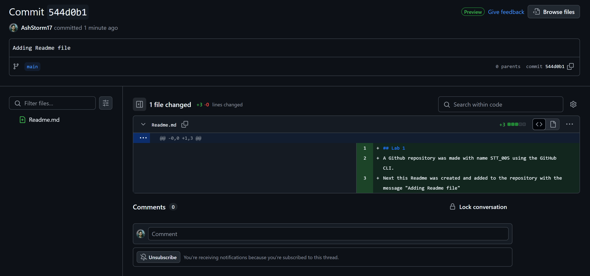

## Lab 1
A Github repository was made with name STT_005 using the GitHub CLI.
Next this Readme was created and added to the repository with the message "Adding Readme file"

The commit history was observed.

A .gitignore file was created to disable pycache and venv files from being uploaded.
This was needed as these are local files, 
.venv: a virtual environment to run python on VM
pycache: to store checkpoints during execution of a file

Then a python file was added to test with pylint